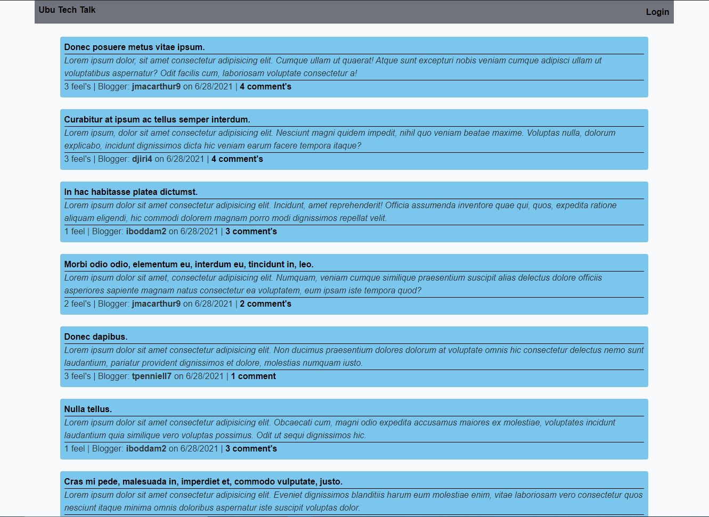

# Tech Blog
## Description
A live site to blog about different technology. Create an account to add comments to different blogs as well as create your own blog post. If you're feelin' a blog, drop a "Feel" on it!

## Table of Contents
* [Usage](#usage)
* [Questions](#questions)

      
* [Credits](#credits)
        
* [License](#license)
        
* [Features](#features)
        
* [Contributing](#contributing)
        
    
  

## Usage
When you visit the homepage you'll be see a list of existing blog posts.  Click on a blog to see it and it's added comments.  Click on "Login" in the upper-right corner to go to the SignIn/SignUp page. There you can either sign in if you have an existing account or sign up with an email and password.  Once signed in, you'll be directed to your dashboard where you can create a blog post and see blogs you've created.  Click on "Edit Blog" to edict that existing blog Title, Context, or add a comment.  Once logged in, navigate to the homepage by clicking the link in the upper-left corner. When you now click on an existing page you'll be able to add a comment. If you're "feelin'" a blog, click on "Feelin' It" to add a feel.  Navigate back to your dashboard by clicking on "Your Dash" in the upper-right corner.  Logout by clicking on "Logout" in the upper-right corner.

### Screenshot

    

### Link
https://sir-ubu-tech-blog.herokuapp.com/
    

## Credits
RESOURCES [bcrypt](https://www.npmjs.com/package/bcrypt) [Connect Session Store Sequelize](https://www.npmjs.com/package/connect-session-sequelize) [dotenv](https://www.npmjs.com/package/dotenv) [express](https://www.npmjs.com/package/express) [Handlebars](https://www.npmjs.com/package/handlebars) [express-session](https://www.npmjs.com/package/express-session) [MySQL2](https://www.npmjs.com/package/mysql2) [Sequelize](https://www.npmjs.com/package/sequelize) [uniqid](https://www.npmjs.com/package/uniqid)
    

## License

       

## Contributing
This application is not open to outside contribution.

## Questions
For all questions regarding this project, feel free to contact me at:

GitHub: [SirUbu](https://github.com/SirUbu)

Email: thesirubu@gmail.com
